##basic unix commands practice outputs
## GENERAL  COMMANDS OUTPUTS 
### CAT COMMAND manual
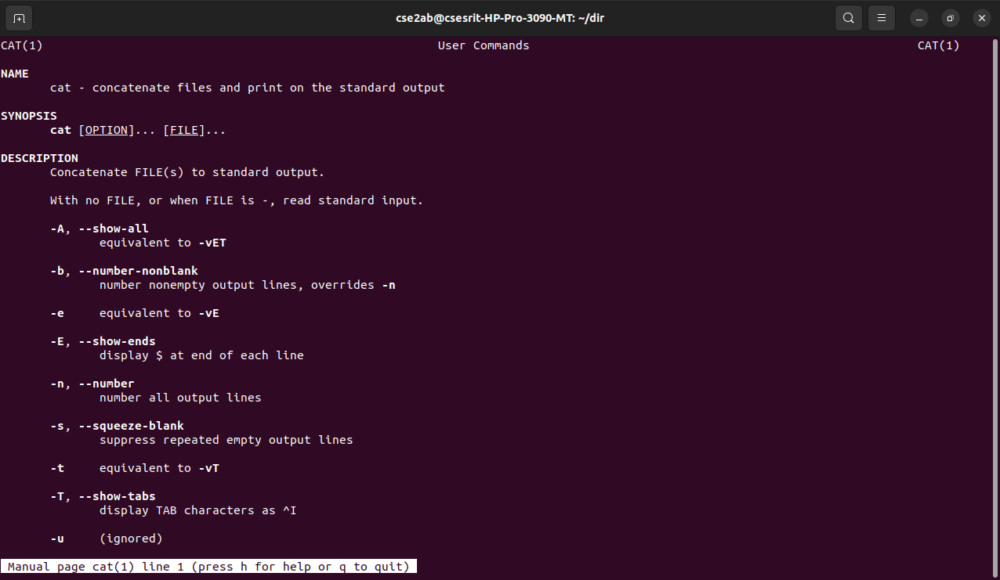
### CAT COMMAND OUTPUT
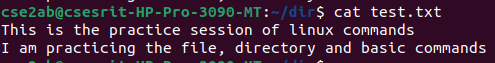
### CAT COMMAND OUTPUT
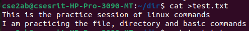
### CAT COMMAND OUTPUT
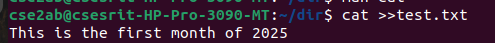
### CD COMMAND OUTPUT
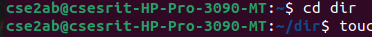
### CMP COMMAND OUTPUT
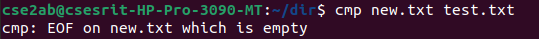
### CP COMMANd OUTPUT
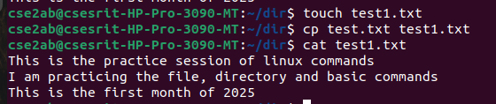
### CPIWARNING COMMAND OUTPUT
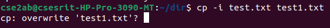
### DATE COMMAND OUTPUT
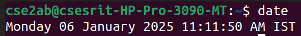
### DATE COMMAND OUTPUT

### DATE COMMAND OUTPUT

### DATE COMMAND OUTPUT

### DATE COMMAND OUTPUT

### ECHO COMMAND OUTPUT
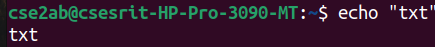
### ECHOHOME COMMAND OUTPUT
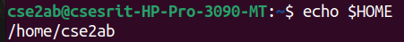
### HISTORY COMMAND OUTPUT
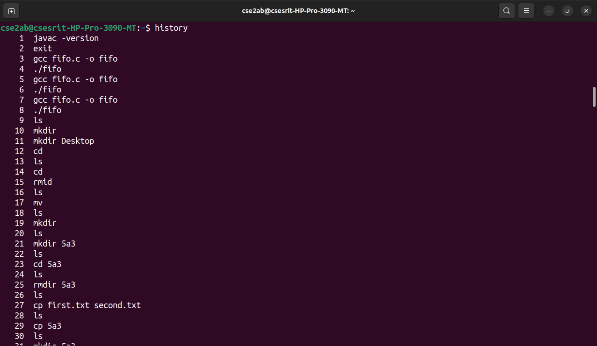
### LS COMMAND OUTPUT

### LSA COMMAND OUTPUT

### LSL COMMAND OUTPUT
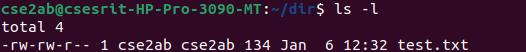
### LSNAMECOMMAND OUTPUT

### LSR COMMAND OUTPUT
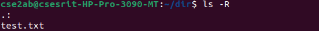
###LSXDIR COMMAND OUTPUT
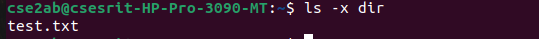
### MCAT COMMAND MANUAL

### MCD COMMAND MANUAL
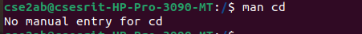
### MCHMOD COMMAND MANUAL
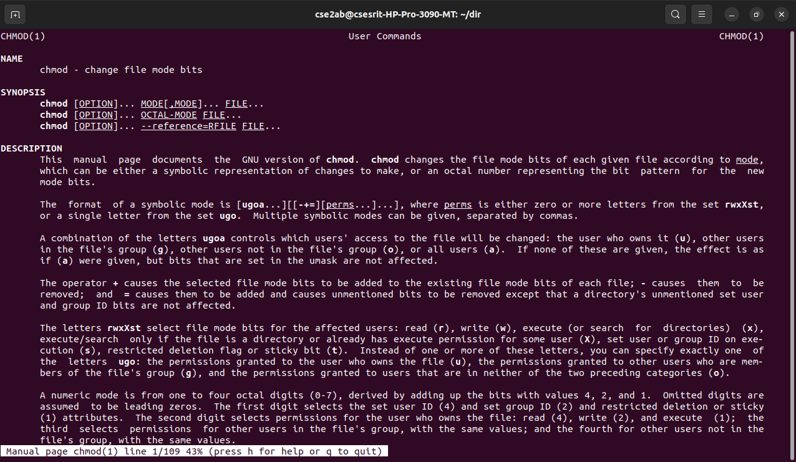
### MCMP COMMAND MANUAL
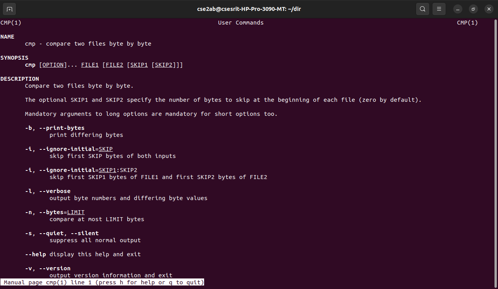
### MCP COMMAND MANUAL
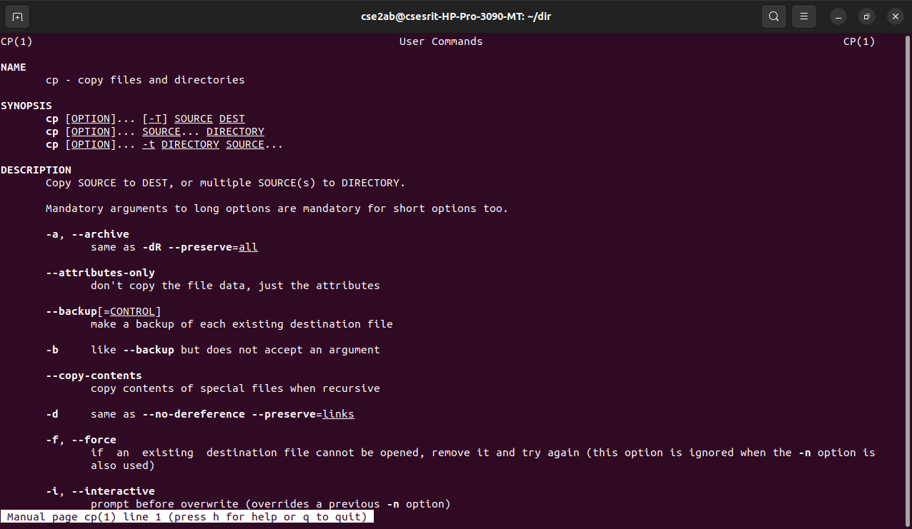
### MDATE COMMAND MANUAL
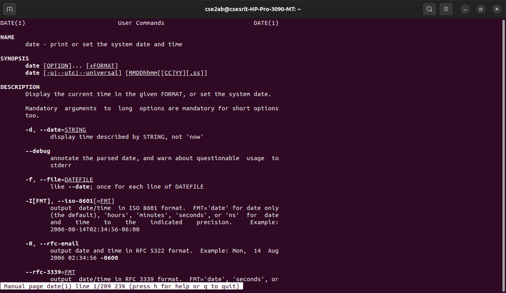
### MDATE COMMAND MANUAL
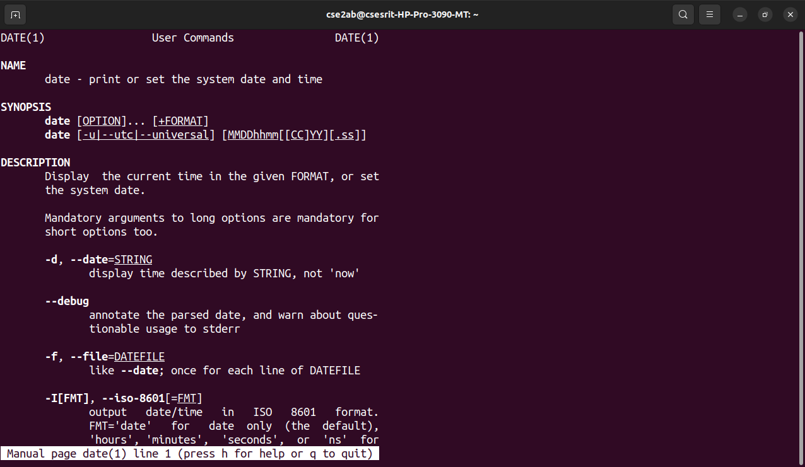
### ECHO  COMMAND MANUAL
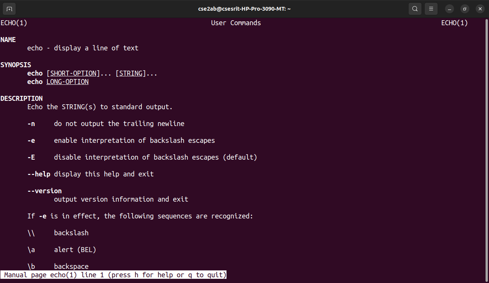
### EXIT COMMAND MANUAL
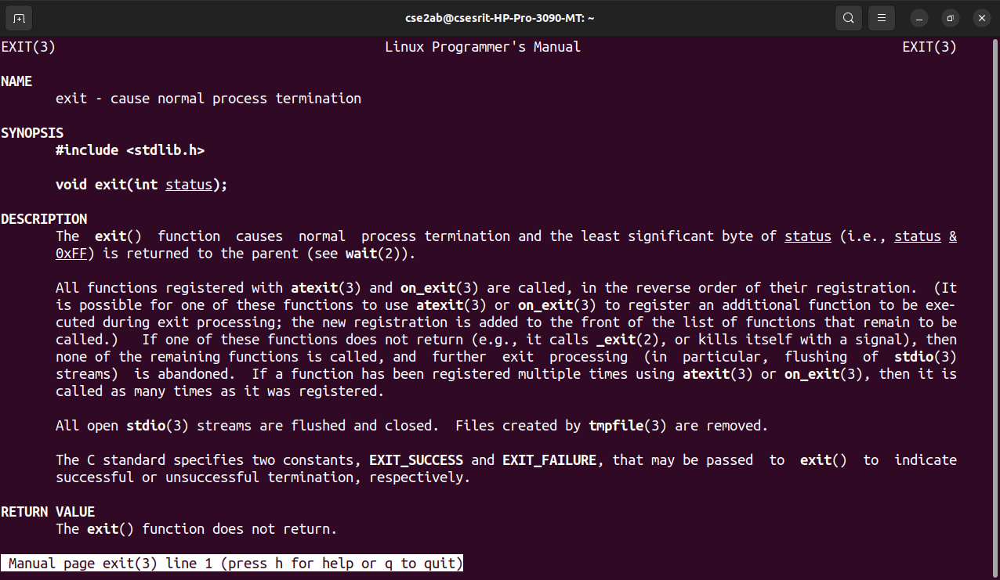
### HISTORY COMMAND MANUAL

### LS COMMAND MANUAL
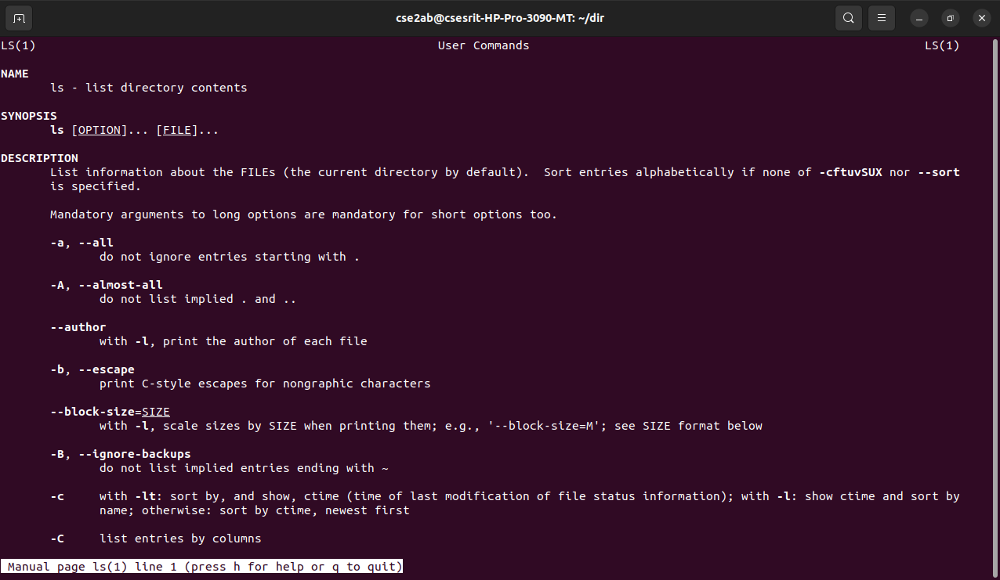
### MKDIR COMMAND OUTPUT
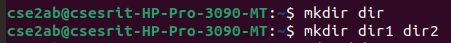
### MKDIR COMMAND MANUAL
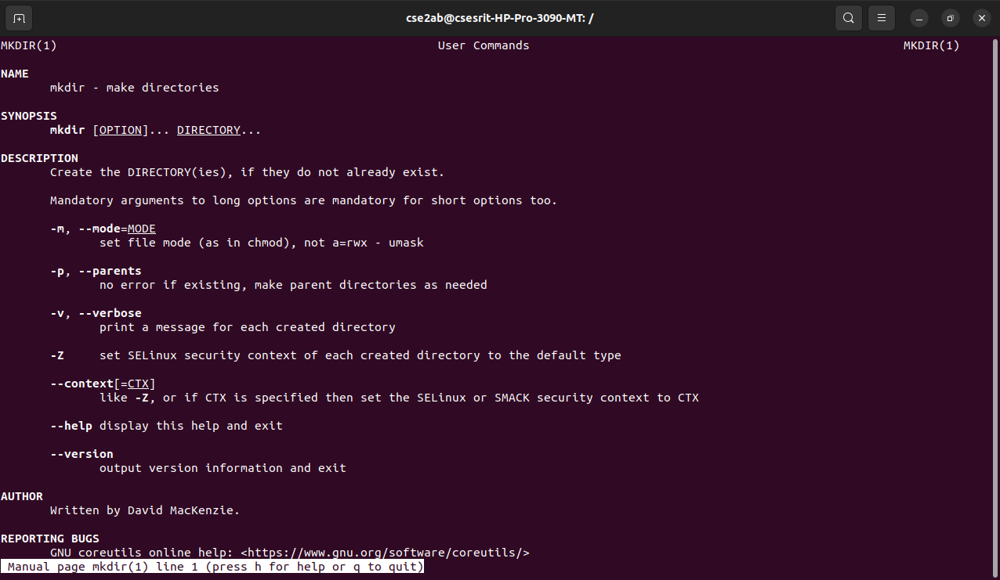
### MV COMMAND MANUAL
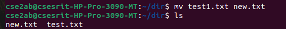
### PWD COMMAND MANUAL
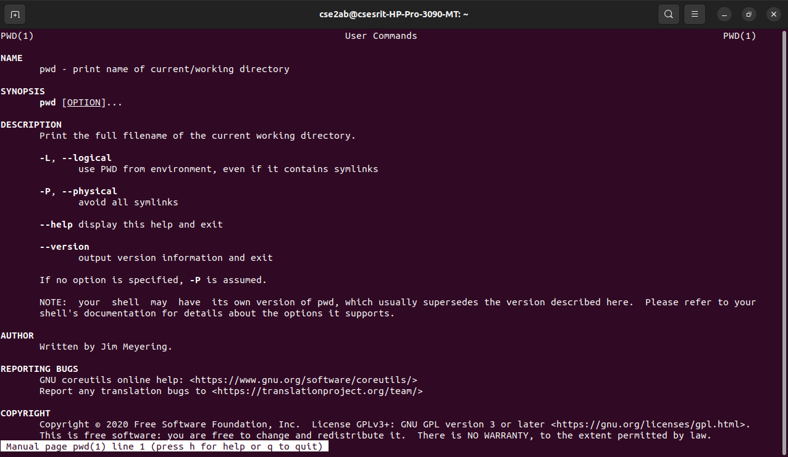
### TTY COMMAND MANUAL
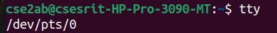
### UNAME COMMAND MANUAL
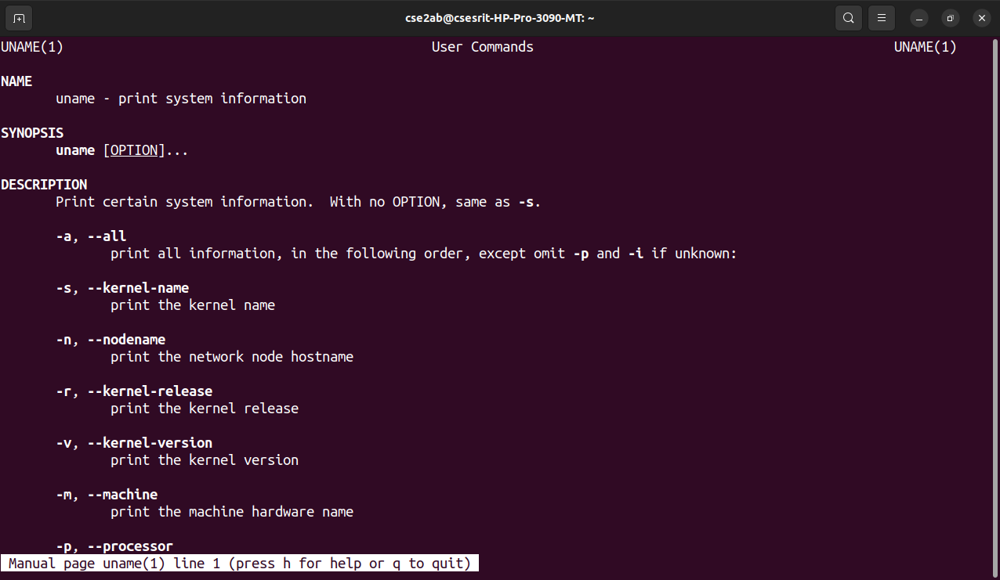
### MV COMMAND OUTPUT

### PWD COMMAND OUTPUT
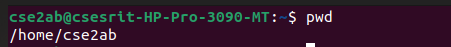
### RMFILE COMMAND OUTPUT
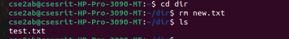
### TOUCH COMMAND OUTPUT
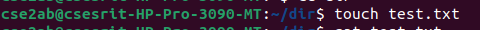
### TTY COMMAND OUTPUT

### UNAME COMMAND OUTPUT
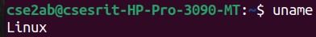
### UNAME COMMAND OUTPUT
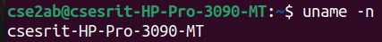
### UNAMER COMMAND OUTPUT
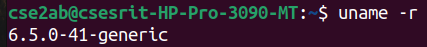
### WC COMMAND OUTPUT
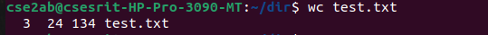
### WHO COMMAND OUTPUT

# Conclusion: The Study And Execution Of Unix Commands Has Been Completed Successfully.
